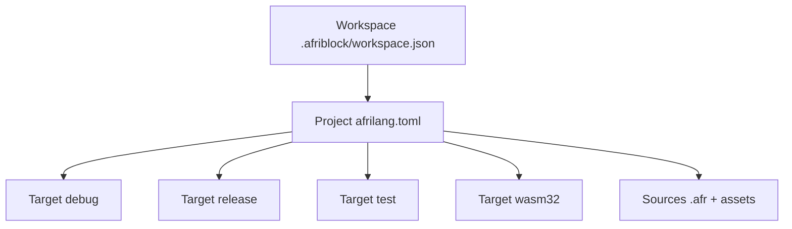
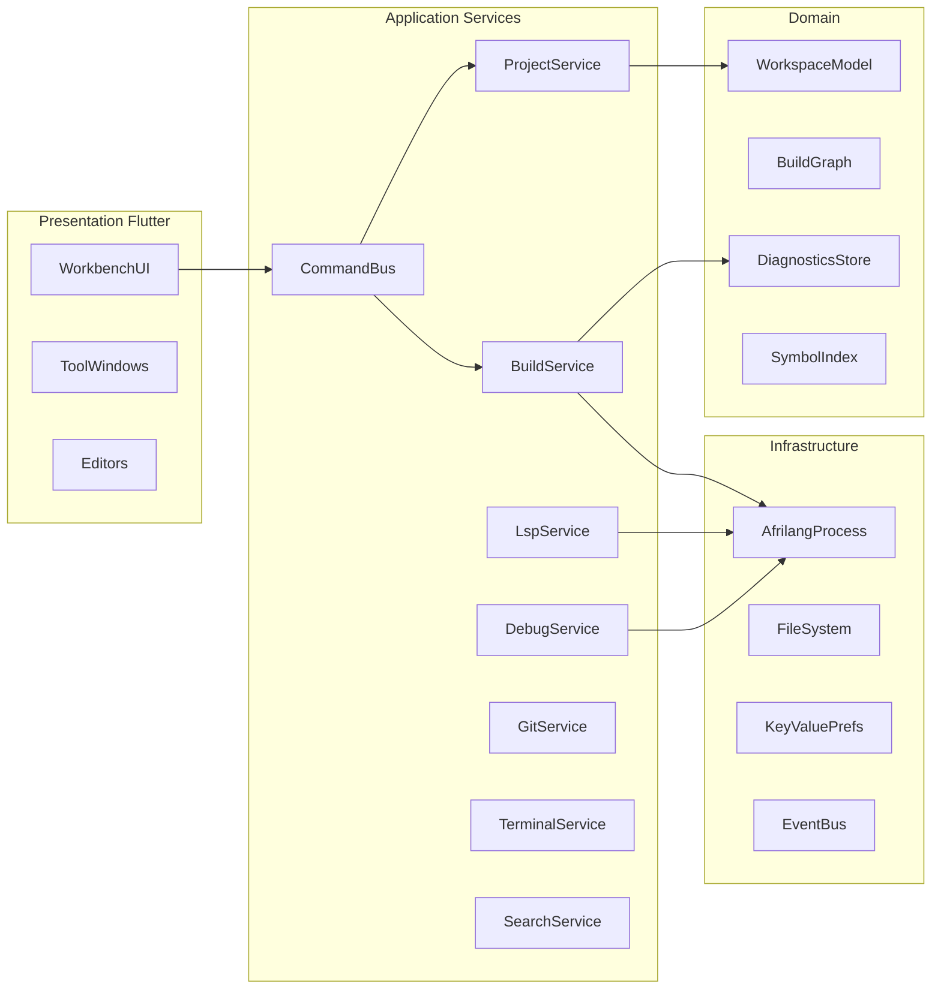
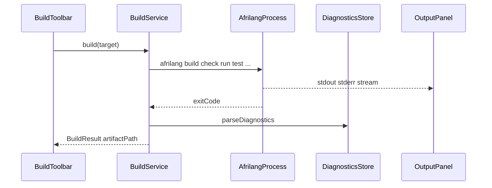

# AFRIBLOCK — Architecture IDE mondiale (AFRILANG-only)

> Canonical architecture for the official AFRILANG desktop IDE.
> Status: living document. Implementation maturity is per-phase (A–F), not “VS Code parity”.

## 1. Vision

**AFRIBLOCK** is the official Flutter desktop IDE for **AFRILANG only**
(Linux / Windows / macOS). Product goal: a world-class loop to
**write → compile → test → debug → package** `.afr` projects.

It is **not** a multi-language IDE and does **not** reimplement the compiler.
All real builds go through the `afrilang` binary (and host C++ / GDB / WASM
toolchains that `afrilang` already orchestrates).

### Inspiration (structure, not clones)

| Source | What we take |
|--------|----------------|
| Code OSS / VS Code | Workbench chrome, command palette, keybindings, trust model |
| Code::Blocks | Workspace → Project → Build targets, build log UX, auto-build before debug |
| CLion / IntelliJ | Tool windows, run configs, structure/outline, inspections feel |
| Lumide / flutter_ide | Native Flutter editor (no Monaco on Linux) |

### Monorepo anchors

- CLI: `afrilang build|run|check|test|fmt|lint|lsp|debug|pkg|init|explain|…` — `src/utils/cli.cpp`
- Projects: `afrilang.toml` + `afrilang pkg …`
- LSP subset: `docs/TOOLING.md`, `afrilang lsp`
- DAP/GDB: `vscode-afrilang/debugAdapter.js`, `afrilang debug`
- App: `ide/afriblock/`

---

## 2. Non-negotiable principles

1. **Compile for real** — Build / Run / Debug always invoke `afrilang` (never a simulated compiler).
2. **Language-locked** — First-class support is AFRILANG / `.afr` only.
3. **Honesty** — No “LSP 1.0 complete” or “IDE = VS Code” claims; maturity is phase-tagged.
4. **Desktop performance** — Native editor; heavy I/O off the UI isolate; target 60 fps chrome.
5. **Security** — Explicit toolchain paths; confirm dangerous actions; honor sandbox when Run uses it.
6. **Internal extensibility** — In-process Dart plugins with a stable API; no third-party `.so` marketplace until API freeze.

---

## 3. Product mental model (Code::Blocks hierarchy)



| Concept | Meaning |
|---------|---------|
| **Workspace** | 1..N AFRILANG projects, build order, open folders, UI layout |
| **Project** | Directory with `afrilang.toml` (`afrilang init` / IDE wizard) |
| **Build target** | Named profile: CLI args + env + cwd + expected artifact |
| **Run configuration** | Target + program args + env + console sink (Output vs PTY) |

On-disk IDE state lives under **`.afriblock/`** inside the workspace root:

- `workspace.json` — multi-root / project list
- `launch.json` — debug / run configs
- `tasks.json` — custom tasks
- `keybindings.user.json` — user key overrides
- `ui-state.json` — panel sizes, last target, open editors

---

## 4. Layered software architecture



### Dart package map (evolution of `ide/afriblock/lib/`)

| Package / area | Responsibility |
|----------------|----------------|
| `core/` | EventBus, CommandBus, settings schema, plugin host |
| `workbench/` | Shell UI |
| `editor/` | Buffer, highlighter, folds, multi-cursor (future) |
| `project/` | Workspace / project / target + TOML |
| `build/` | Orchestrator + streaming log + problem matchers |
| `lsp/` | JSON-RPC stdio client |
| `debug/` | DAP client (port of vscode-afrilang contract) |
| `terminal/` | PTY sessions |
| `git/` | Porcelain git |
| `search/` | Find in Files |
| app host | Composition root (`main.dart` / `app.dart`) |

Today many of these live as folders under `lib/` inside the single `afriblock` package; splitting into pub workspaces is a later packaging step.

---

## 5. Workbench surface (world-class chrome)

### Activity bar & sidebars

- Explorer (files + project roots)
- Search (Find in Files)
- Source Control (Git)
- Run & Debug
- Test Explorer
- AFRILANG Hub (pkg / stdlib browser)
- Extensions (built-in plugin list)

### Editor area

- Tabs, dirty markers, close
- Split groups (horizontal / vertical)
- Breadcrumbs + Outline
- Quick Open (`Ctrl/Cmd+P`), Command Palette (`Ctrl/Cmd+Shift+P`), Go to Symbol

### Panel

- Problems, Output, Debug Console, Terminal(s), Test Results

### Status bar

- Toolchain path / version, Git branch, diagnostic counts, encoding, active target, LSP state

### Build toolbar (Code::Blocks-style)

- Target dropdown: `debug` | `release` | `test` | `wasm32`
- Build / Rebuild / Clean / Run / Debug

### Themes & a11y

- Dark (default), Light, High Contrast
- UI scale, reduce motion, full keyboard navigation

---

## 6. Editor (AFRILANG)

**Engine:** native Flutter buffer (evolve `lib/widgets/code_editor.dart`). No Monaco (Linux gap).

| Feature | Notes |
|---------|--------|
| Lexical highlight | Keywords / types / strings / comments |
| Semantic highlight | Best-effort when LSP semantic tokens exist |
| Format | `afrilang fmt -w` on save |
| Diagnostics | Squiggles from LSP + build problem matcher |
| Navigation | Definition / references / rename via LSP |
| Completion | Keywords + LSP + stdlib stubs |
| Outline | `documentSymbol` or local SymbolIndex |
| Large files | Disable semantic path above ~2 MiB |

---

## 7. Toolchain & BuildService

### Resolution order

1. `AFRIBLOCK_AFRILANG`
2. User setting
3. Monorepo candidates (`../../build/afrilang`, …)
4. `PATH`

### Capability probe

`afrilang version`, GDB presence, Emscripten (wasm), OS sandbox hints.

### Build pipeline



| Action | CLI |
|--------|-----|
| Build project | `afrilang build` |
| Check | `afrilang check` |
| Run | `afrilang run` |
| Test | `afrilang test` / `pkg test` |
| Fmt / Lint | `afrilang fmt` / `lint` |
| WASM | `build-wasm-web`, `compile-js` as advanced targets |
| Clean | purge `build/` (+ cache policy documented) |

**Build log UX:** colorized severity, click `file:line:col`, cancel, timings, workspace dependency order.

---

## 8. LSP

Client: JSON-RPC over stdio → `afrilang lsp`.

Wired IDE features (subset honesty): diagnostics, completion, hover, definition, references, rename, document/workspace symbols, formatting, codeAction.

Lifecycle: start on project open, crash restart with backoff, Output channel “AFRILANG LSP”, incremental `didChange` when ready.

Complement: local **SymbolIndex** for fast Outline when LSP is cold.

---

## 9. Debug (DAP)

Port the contract of `vscode-afrilang/debugAdapter.js` into Dart:

- Launch: ensure build up-to-date → `afrilang debug` / GDB MI
- Breakpoints, continue / step, stack, variables (`debug_meta`), debug console
- Auto-build before debug (Code::Blocks `EnsureBuildUpToDate` pattern)

---

## 10. Terminal, Git, Search, Tests, Packages

- **Terminal:** multi-session PTY, cwd = project root
- **Git:** status, diff, stage/commit/push/pull via `git`
- **Search:** Find in Files (prefer `rg`, else Dart walk)
- **Test Explorer:** discover / run / re-run failed
- **AFRILANG Hub:** `pkg list|search|add|install|update|publish` + init templates
- **Explain:** surface `afrilang explain` on symbols / diagnostics

---

## 11. Plugin SDK (internal, cbPlugin-like)

```dart
abstract class AfriblockPlugin {
  String get id;
  Future<void> onActivate(PluginContext ctx);
  Future<void> onDeactivate();
}
```

Contributions: commands, menus, views, build targets, problem matchers.

Built-ins: AfrilangLanguage, AfrilangBuild, AfrilangDebug, Git, Terminal, TestExplorer, PkgBrowser.

No third-party native loading before API freeze.

---

## 12. Security & trust

- Show resolved `afrilang` path + version in UI
- Confirm `pkg publish` and custom post-build scripts
- Honor Landlock/sandbox when the runtime enables it
- Workspace trust prompt for non-local folders

---

## 13. Implementation roadmap

| Phase | Theme | Deliverables |
|-------|--------|--------------|
| **A** | Foundation | `afrilang.toml` detection, streamed build, toolchain settings UI, Quick Open |
| **B** | Intelligence | LSP client, format-on-save, Outline |
| **C** | Project/Build | Targets debug/release/test/wasm, Test Explorer, build toolbar |
| **D** | Debug | DAP-oriented debug UI, breakpoints, debug console |
| **E** | Terminal/Git/Search | PTY, SCM view, Find in Files |
| **F** | Polish | Splits, keybindings, themes, plugin SDK docs, packaging notes |

**Validation per phase:** `flutter analyze` + Linux smoke on an `examples/` project; no feature claimed without a harness or manual checklist.

---

## 14. Explicit non-goals

- Multi-language first-class support (Python/C++ as peers)
- Cloud IDE / real-time collab
- Public extension marketplace
- Replacing `vscode-afrilang` (coexistence)
- Rewriting the compiler in Flutter

---

## 15. Related docs

- [`ide/afriblock/README.md`](../ide/afriblock/README.md)
- [`docs/TOOLING.md`](TOOLING.md)
- [`ide/afriblock/docs/PLUGIN_SDK.md`](../ide/afriblock/docs/PLUGIN_SDK.md) (phase F)
- `vscode-afrilang/README.md`
